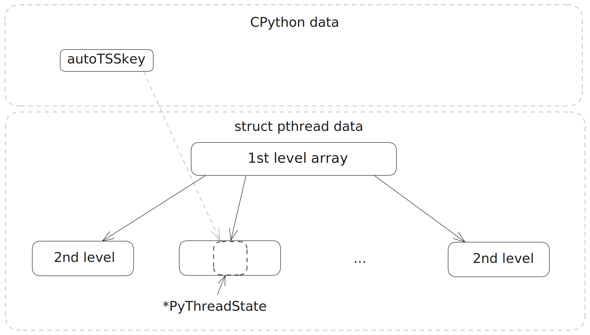

# Python Current Thread State Collection

Each native thread is mapped to one `PyThreadState` structure which contains information about the corresponding Python thread.


Perforator utilizes multiple ways to obtain current `*PyThreadState` in eBPF context - reading from Thread Local Storage (TLS) or Thread Specific Storage (TSS) and extracting from global variables - such as `_PyRuntime` or others. The combination of these approaches and caching helps to improve the accuracy of the `*PyThreadState` collection.

## Reading `*PyThreadState` from TLS

In Python 3.12+, a pointer to current thread's `PyThreadState` is stored in a Thread Local Storage variable called `_PyThreadState_Current`.

In an eBPF program, the pointer to Thread Control Block (TCB) can be retrieved by reading `thread.fsbase` from the `task_struct` structure. This structure can be obtained with the `bpf_get_current_task()` helper. The Thread Local Image will be to the left of the pointer stored in `thread.fsbase`.

The exact offset of thread local variable `_PyThreadState_Current` in Thread Local Image is unknown yet. Therefore, the disassembler is used to find the offset of `_PyThreadState_Current`.


### Parsing offset of `_PyThreadState_Current` in Thread Local Image

`_PyThreadState_GetCurrent` is a simple getter function which returns the pointer from `_PyThreadState_Current` thread local variable and looks somewhat like this:

**Optimized build**:

```
000000000028a0b0 <_PyThreadState_GetCurrent@@Base>:
  28a0b0:       f3 0f 1e fa             endbr64
  28a0b4:       64 48 8b 04 25 f8 ff    mov    %fs:0xfffffffffffffff8,%rax
  28a0bb:       ff ff
  28a0bd:       c3                      ret
  28a0be:       66 90                   xchg   %ax,%ax
```

**Debug build**:

```
0000000001dad910 <_PyThreadState_GetCurrent>:
 1dad910:       55                      push   %rbp
 1dad911:       48 89 e5                mov    %rsp,%rbp
 1dad914:       48 8d 3d 15 6e 65 00    lea    0x656e15(%rip),%rdi        # 2404730 <_PyRuntime>
 1dad91b:       e8 10 00 00 00          callq  1dad930 <current_fast_get>
 1dad920:       5d                      pop    %rbp
...
...
...
0000000001db7c50 <current_fast_get>:
 1db7c50:       55                      push   %rbp
 1db7c51:       48 89 e5                mov    %rsp,%rbp
 1db7c54:       48 89 7d f8             mov    %rdi,-0x8(%rbp)
 1db7c58:       64 48 8b 04 25 00 00    mov    %fs:0x0,%rax
 1db7c5f:       00 00
 1db7c61:       48 8d 80 f8 ff ff ff    lea    -0x8(%rax),%rax
 1db7c68:       48 8b 00                mov    (%rax),%rax
 1db7c6b:       5d                      pop    %rbp
 1db7c6c:       c3                      retq
```

Looking at these functions, the offset relative to `%fs` register which is used to access `_PyThreadState_Current` variable in userspace can be extracted for later use in the eBPF program.

## Reading `*PyThreadState` from TSS

Before CPython 3.12 libpthread thread specific storage was used to store current `*PyThreadState`. There is a global variable (`autoTLSkey` or `PyRuntime->autoTSSkey`) which stores a key to TSS for the value of current thread state. BPF code implements logic of TSS variable lookup similar to libpthread to obtain the data. 

The address of TSS key can be retrieved by parsing `PyGILState_Ensure` function.

Dissassembling `pthread_getspecific` allows to retrieve the following data from the libpthread binary:

```
struct TPthreadKeyDataInfo {
    ui64 Size = 0;
    ui64 ValueOffset = 0;
    ui64 SeqOffset = 0;
};

struct TAccessTSSInfo {
    TPthreadKeyDataInfo PthreadKeyData;
    ui64 FirstSpecificBlockOffset = 0;
    ui64 SpecificArrayOffset = 0;
    ui64 StructPthreadPointerOffset = 0;
    ui64 KeySecondLevelSize = 0;  // PTHREAD_KEY_2NDLEVEL_SIZE
    ui64 KeyFirstLevelSize = 0;   // PTHREAD_KEY_1STLEVEL_SIZE
    ui64 KeysMax = 0;             // PTHREAD_KEYS_MAX
};
```
The pthread TSS is organized as a 2-level array of `struct pthread_key_data`. First array of `PTHREAD_KEY_1STLEVEL_SIZE` size contains pointers to the chunks of `struct pthread_key_data` of `PTHREAD_KEY_2NDLEVEL_SIZE` size. First chunk of 2nd level is preallocated in `struct pthread`. The maximum total number of thread key-value pairs `PTHREAD_KEYS_MAX`.

The key is an index in 2-level array. `i / PTHREAD_KEY_2NDLEVEL_SIZE` is index for top-level array, `i % PTHREAD_KEY_2NDLEVEL_SIZE` is index for the bottom-level array.

The pointer to the top-level array can be obtained through `struct pthread` by reading `current_task->thread.fsbase`.




## Thread state list retrieval from global variables (`_PyRuntime` or `interp_head`)

In CPython 3.7 global variable `_PyRuntime` was introduced. This structure holds most of the runtime data including the list of `PyInterpreterState`. Given the `PyInterpreterState` object we can access `PyThreadState`'s associated with it by reading `tstate_head` field. This field stores a pointer to the head of interpreter's thread states list. The address of `_PyRuntime` can be found in  the ELF symbols sections.

Before the `_PyRuntime` there was another global variable containing interpreter list - `interp_head` which is available even in CPython 2.4. The `interp_head` address can be retrieved by disassembling `PyInterpreterState_Head` function which is a simpler getter for the variable.

The  picture below shows the layout of interpreter state and thread state lists which is almost the same for both `_PyRuntime` and `interp_head` cases.


## Restoring the mapping `(pid, thread_id)` -> `*PyThreadState`

We store a mapping `(pid, thread_id)` -> `*PyThreadState` which allows `*PyThreadState` retrieval on failed BPF reads or other scenarios (e.g. TLS variable with current thread state stores NULL pointer because of released GIL).

In CPython 3.11 `native_thread_id` field was introduced on `PyThreadState` structure. For Linux this field stores TID in some PID namespace. Thereby we can store `(pid, native_thread_id)` pair as a key to the `*PyThreadState`. Upon lookup we can use current task's PID and TID in innermost PID namespace.

Before CPython 3.11 `thread_id` field on `PyThreadState` structure contained the `thread_id` returned by pthread library. We only support glibc libpthread of version 2.4+ here. Actually in this setting this `thread_id` is just a pointer to `struct pthread` of the thread. Upon lookup we can use current task's PID and `current_task->thread.fsbase` because it stores a pointer to TCB which is actually a header of `struct pthread`, so this is just a pointer to the current thread structure. 

## Combination of approaches

By combining these approaches, we can improve the accuracy of the stack collection. `_PyThreadState_Current` is `NULL` if the current OS thread is not holding a GIL. In this case, the mapping `(pid, thread_id)` -> `*PyThreadState` can be used to find the correct `*PyThreadState`. Also, occasionally we need to trigger the `PyThreadState` linked list traversal to fill the map.

Collecting the stack of threads which are not holding a GIL is crucial for a more accurate picture of what the program is doing. The OS thread may be blocked on I/O operations or executing compression/decompression off-GIL.
